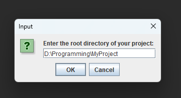

# Project-Line-Counter
This little program counts your total lines of source code and blank lines of your coding project.
## Usage
In the first window, enter the path to your project´s root directory. This could look something like this: 
  

  
In the second window, you have to enter the file extensions of the files you want to count the lines of. So, e.g., if you want to count only java files, simply type java in the input box.
If you want to include multiple file extensions in the counting process, separate them by a comma like this:
  

  
After that, you wait until the program finished the counting. Then you should see a window like this, which tells you the exact lines of code of the directory you entered before:
  

